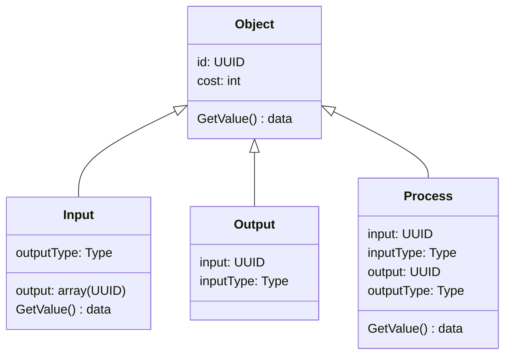

# ARCHITECTURE

## 機能

- ユーザ機能
  - 作った本人が見れる
- サービスの作成
- サービスの利用
- サービスの保存
- サービス
  - オブジェクト(I/O)
  - 計算処理
    - 加算・減算・乗算・除算
  - 分岐
  - 順序

## 役割

- フロントエンド
  - ログイン画面
  - エディター
    - サービス作る(Scratch風な)
    - 出力
      - Jsonにして出力
    - 読み込み
  - ビュー
    - 与えられたUIDからJsonを読み込んでサービスを表示

- バックエンド
  - ログイン要求
  - セッション
  - 新しいUIDを返す(新規作成)
  - 送られてきたJSONをUIDと紐つけて保存する
  - 与えられたUIDからJsonの要求を受け付けてJsonを返す

## 制約

- 入力数に制限
- ループ禁止

## データフォーマット

## 動作順序

- 以下ループ
  - 1つ入力を探し出して、他の入力が必要なところに来るまで実行
