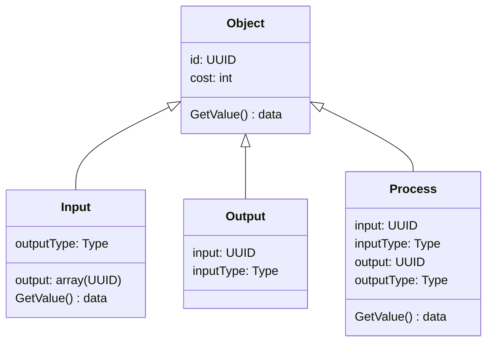
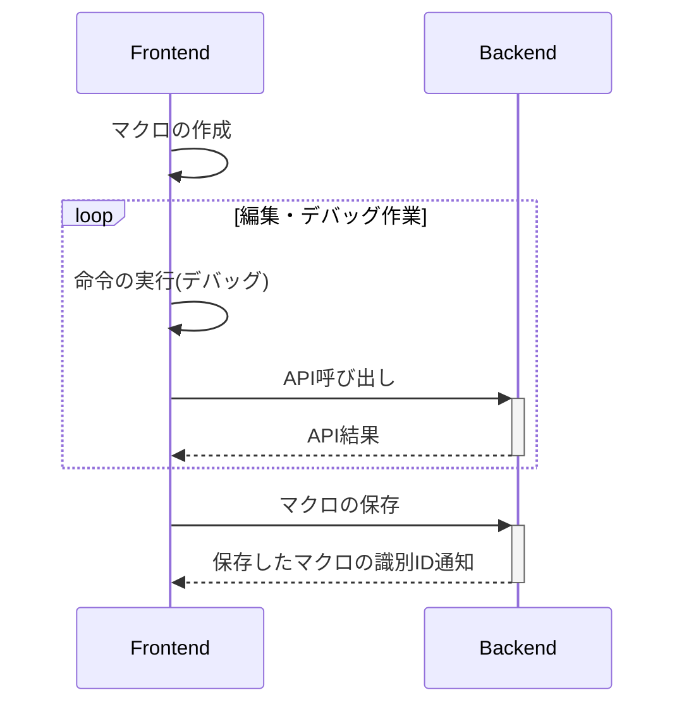

# ARCHITECTURE

## 目次
<!-- @import "[TOC]" {cmd="toc" depthFrom=2 depthTo=6 orderedList=false} -->

<!-- code_chunk_output -->

- [目次](#目次)
- [機能](#機能)
- [役割](#役割)
- [制約](#制約)
- [データフォーマット](#データフォーマット)
- [動作順序](#動作順序)
- [編集機能](#編集機能)
  - [編集機能概要](#編集機能概要)
  - [編集機能注意点](#編集機能注意点)

<!-- /code_chunk_output -->

## 機能

- ユーザ機能
  - 作った本人が見れる
- サービスの作成
- サービスの利用
- サービスの保存
- サービス
  - オブジェクト(I/O)
  - 計算処理
    - 加算・減算・乗算・除算
  - 分岐
  - 順序

## 役割

- フロントエンド
  - ログイン画面
  - エディター
    - サービス作る(Scratch風な)
    - 出力
      - Jsonにして出力
    - 読み込み
  - ビュー
    - 与えられたUIDからJsonを読み込んでサービスを表示

- バックエンド
  - ログイン要求
  - セッション
  - 新しいUIDを返す(新規作成)
  - 送られてきたJSONをUIDと紐つけて保存する
  - 与えられたUIDからJsonの要求を受け付けてJsonを返す

## 制約

- 入力数に制限
- ループ禁止

## データフォーマット

## 動作順序

- 以下ループ
  - 1つ入力を探し出して、他の入力が必要なところに来るまで実行

## 編集機能

### 編集機能概要

- 主に編集やデバッグはフロントエンド側で行う
- APIが必要な場合だけバックエンドに問い合わせ
- バックエンド側へ保存するときに、違反したデータや不正なデータでないか検証する
- マクロ保存後は、ビュー画面で表示できるよう識別IDを通知する

### 編集機能注意点

- オブジェクト・命令の数の制限(フロント側でコスト表示)
- オブジェクト・命令の数の制限(バックエンド側でチェック)
- デバッグ時のAPI呼び出し回数の制限(バックエンド)
- API呼び出しの制限到達を通知(フロントエンド)
- ループ検知して停止(同じオブジェクトを２回通ったら停止。)
