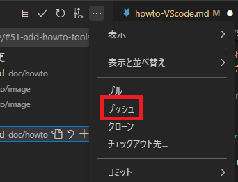

# VScodeの使い方
<!-- @import "[TOC]" {cmd="toc" depthFrom=2 depthTo=6 orderedList=false} -->

<!-- code_chunk_output -->

- [ショートカットキーに関して](#ショートカットキーに関して)
- [1. branchの切り方](#1-branchの切り方)
- [2. pushの仕方](#2-pushの仕方)

<!-- /code_chunk_output -->

## ショートカットキーに関して
 
 Ctrl + Shift + V  ・・・別タブでプレビュー表示

## 1. branchの切り方

1. VScode右下のブランチまたはタグのチェックアウトを選択

2. 新しい分岐の作成を選択し、ブランチ名を入力。
　 命名規則は #Issue番号-タイトル

## 2. pushの仕方

1. 左上のソース管理を選択

2. 「変更」リストから、変更をステージを選択

3. 三点リーダーを選択し、プッシュを選択

